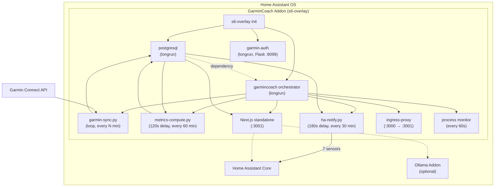

# GarminCoach — Home Assistant Addon

[](https://my.home-assistant.io/redirect/supervisor_add_addon_repository/?repository_url=https%3A%2F%2Fgithub.com%2Faskb%2Fha-garmin-fitness-coach-addon)

AI-powered sport scientist that turns your Garmin data into actionable
coaching, training analysis, and recovery optimization — running entirely on
your local network.

---

## Table of Contents

- [Features](#features)
- [Architecture](#architecture)
- [Installation](#installation)
- [Configuration](#configuration)
- [Garmin Authentication](#garmin-authentication)
- [AI Backend Options](#ai-backend-options)
- [Known Issues](#known-issues)
- [Development](#development)
- [Contributing](#contributing)
- [License](#license)

## Features

- 🏋️ **Training Load Analysis** — CTL / ATL / TSB (Banister fitness-fatigue
  model), ACWR injury-risk tracking (Hulin 2016)
- 📊 **Zone Analytics** — HR zone distribution, Seiler polarization index,
  efficiency trends, calendar heatmap
- 🧠 **AI Specialist Agents** — Sport scientist, psychologist, nutritionist,
  recovery coach (via HA Conversation, local Ollama, or rules-based)
- 🏃 **Race Predictions** — Riegel formula for 5K / 10K / half-marathon /
  marathon
- 💤 **Sleep Coaching** — Sleep debt tracking, bedtime recommendations, quality
  trends, stage analysis
- 📈 **6+ Year Trends** — Long-term multi-metric overlay charts with rolling
  averages and notable-change detection
- 🩺 **Readiness Score** — Evidence-based daily score (0-100) using HRV, sleep,
  training load, and stress (Buchheit 2014)
- 🔒 **Fully Private** — All data stays local; AI runs on your hardware

## Architecture



```text
Startup order:
  postgresql → garmin-auth (parallel) → garmincoach orchestrator
    → garmin-sync (background loop, waits for tokens)
    → metrics-compute (120s delay, then every 60 min)
    → ha-notify (180s delay, then every 30 min)
    → Next.js standalone server (:3001)
    → ingress-proxy (:3000 → :3001, HA ingress path rewriting)
    → process monitor (restarts dead services every 60s)
```

Supported architectures: **amd64**, **aarch64**.

## Installation

### One-Click Install

Click the button at the top of this README, or:

[](https://my.home-assistant.io/redirect/supervisor_add_addon_repository/?repository_url=https%3A%2F%2Fgithub.com%2Faskb%2Fha-garmin-fitness-coach-addon)

Then install **GarminCoach** from the add-on store and start it.

### Manual Install

1. In Home Assistant go to **Settings → Add-ons → Add-on Store → ⋮ →
   Repositories**.
2. Paste the repository URL:
   ```
   https://github.com/askb/ha-garmin-fitness-coach-addon
   ```
3. Click **Add**, then find **GarminCoach** in the store and click **Install**.
4. Wait for the build to complete (~10-15 minutes on aarch64, ~5 min on amd64).
5. Start the addon — it appears in your sidebar automatically.

### First-Time Setup

1. **Open the addon** from your HA sidebar (or Settings → Add-ons → GarminCoach → Open Web UI).
2. **Complete the onboarding wizard** (4 steps):
   - **About You** — age, sex, weight, height
   - **Your Sports** — select sports and goals for each
   - **Weekly Schedule** — training days and session duration
   - **Health & Safety** *(optional)* — health conditions, injuries, medications
3. **Connect Garmin** — go to **Settings → Connect Garmin**, enter your email
   and password. If MFA is enabled, enter the verification code when prompted.
4. **Wait for initial sync** — the first sync pulls your full Garmin history
   (up to 6+ years). This takes **30-45 minutes** due to Garmin API rate
   limits. You can monitor progress in Settings (a progress bar shows sync
   status). Subsequent syncs only pull the last 7 days and take ~30 seconds.
5. **Restart the addon** after the first sync completes to trigger the
   metrics compute and HA sensor push.

> **⚠️ Initial Sync Note:** The first sync fetches all your historical Garmin
> data (daily stats, activities, HR zones) going back to 2019. This is a
> one-time operation that can take 30-45 minutes due to Garmin Connect API
> rate limits (7 days per batch request). The addon will show sync progress
> in Settings. After the initial sync, daily syncs run every 60 minutes
> (configurable) and complete in under a minute.

> **💡 Tip:** You can trigger a manual sync at any time from
> **Settings → 🔄 Sync Now** without waiting for the next scheduled interval.

## Configuration

| Option | Type | Default | Required | Description |
|---|---|---|---|---|
| `garmin_email` | email | — | No | Your Garmin Connect email (or use web-based login in Settings) |
| `garmin_password` | password | — | No | Your Garmin Connect password (or use web-based login in Settings) |
| `ai_backend` | list | `ha_conversation` | No | AI coaching backend (`ha_conversation`, `ollama`, or `none`) |
| `openclaw_agent_id` | string | — | No | OpenClaw agent ID for HA Conversation API (auto-detected if not set) |
| `ollama_url` | url | — | No | Ollama server URL (only when `ai_backend` is `ollama`) |
| `sync_interval_minutes` | integer | `60` | No | How often to pull new data from Garmin (5 – 1440 minutes) |

## Garmin Authentication

GarminCoach authenticates with Garmin Connect using a **web-based auth flow**:

1. Open the addon **Web UI** (sidebar → GarminCoach).
2. Navigate to **Settings → Connect Garmin**.
3. Enter your **email** and **password**. If your account has MFA enabled you
   will be prompted for the one-time code during the same flow.
4. On success the addon stores an OAuth session token locally in
   `/data/garmin-tokens/`. No credentials are sent to any third-party service.

> **Token lifetime:** The session token is valid for roughly **one year**
> before Garmin forces a re-authentication.  The addon will surface a
> notification when a token refresh is needed.

## AI Backend Options

| Backend | Description |
|---|---|
| `ha_conversation` **(default)** | Routes prompts through the Home Assistant Conversation API to whatever agent you have configured (e.g., OpenAI, Claude, local LLM). Zero extra setup if you already use one. |
| `ollama` | Direct HTTP connection to a local [Ollama](https://ollama.com/) instance — fully private, runs on your hardware. Set `ollama_url` to the instance address. |
| `none` | Rules-based coaching only — no LLM required. Still provides all data-driven insights, readiness scores, and training-load analytics. |

## Sprint 1 Features

25 improvements shipped in Sprint 1:

- **Whoop-style journal** — structured daily check-in (body feel, inputs, cycle)
- **Full PMC chart** — CTL / ATL / TSB with colour-coded form zones
- **ACWR gauge** — injury-risk indicator (1.3 / 1.5 thresholds)
- **Proactive insights** — 6-rule engine surfaces cards automatically
- **Activity forensics** — EF, aerobic decoupling, GAP, lap table, RPE
- **Race predictions** — VDOT + Riegel with confidence intervals
- **Intervention tracking** — ice bath, massage, deload, etc. with ratings
- **Critical power page** — CP curve, W′, mFTP, power-duration chart
- **Validation page** — reference measurement comparison with deviation badges
- **Export page** — CSV/JSON download with date-range picker
- **Team page** — multi-athlete profile switcher
- **Readiness card upgrade** — confidence %, data quality dots, action text
- **8 new database tables** — session_report, intervention, advanced_metric, athlete_baseline, data_quality_log, audit_log, reference_measurement, ai_insight
- **metrics-compute.py** — EWMA CTL/ATL/TSB/ACWR/CP computation service
- **ha-notify.py** — pushes 7 sensors to HA + fires injury-risk alerts
- **AI context pipeline** — 10 structured sections in every coaching prompt
- **239 app tests** (Jest + Playwright) and **19 addon tests** (pytest)
- **CI workflows** — typecheck + test + Docker build on every PR

## HA Sensors

`ha-notify.py` pushes 7 sensors to Home Assistant via the Supervisor API:

| Entity ID | Description |
|-----------|-------------|
| `sensor.garmincoach_ctl` | Chronic Training Load (42-day fitness) |
| `sensor.garmincoach_atl` | Acute Training Load (7-day fatigue) |
| `sensor.garmincoach_form` | Training Stress Balance (TSB = CTL − ATL) |
| `sensor.garmincoach_acwr` | Acute:Chronic Workload Ratio (injury risk) |
| `sensor.garmincoach_injury_risk` | Risk level: Low / Moderate / High / Very High |
| `sensor.garmincoach_body_battery` | Current Garmin Body Battery value |
| `sensor.garmincoach_sleep_debt` | Accumulated sleep debt (hours) |

## Automation Templates

Seven ready-to-paste HA automations are provided in
[`HA_AUTOMATIONS.md`](garmincoach/HA_AUTOMATIONS.md):

1. **Low Body Battery Recovery Mode** — dim lights, enable DND
2. **Morning Training Briefing** — daily notification with readiness + plan
3. **High Injury Risk Alert** — ACWR > 1.5 warning
4. **Training Reminder (Fresh)** — nudge when TSB is positive
5. **Sleep Debt Management** — bedtime reminder when debt accumulates
6. **Weekly Summary** — end-of-week training recap
7. **Voice — ACWR Query** — ask your voice assistant about injury risk

## Testing

- **19 pytest tests** covering Garmin auth flow, token handling, daily stats
  sync, activity sync, TRIMP calculation, and ingress proxy path rewriting
- **CI:** GitHub Actions builds the Docker image and runs `pytest -v` on every
  PR

## Known Issues

| Issue | Details |
|---|---|
| **First sync is slow** | The initial sync pulls up to 6+ years of Garmin history (daily stats, activities, HR zones). This takes **30-45 minutes** due to API rate limits. Use the 🔄 Sync Now button in Settings to monitor progress. Subsequent syncs take ~30 seconds. |
| **Garmin MFA prompt** | If MFA is enabled on your Garmin account the addon will request the code during the web-based Settings flow. Enter the code promptly — Garmin's MFA session expires quickly. Re-authenticate from Settings if the MFA step times out. |
| **Token expiry (~1 year)** | Garmin session tokens expire after approximately one year. The addon will show an alert; re-authenticate from **Settings → Connect Garmin**. |
| **Rate limiting** | Garmin may temporarily block requests if the sync interval is too aggressive. Keep `sync_interval_minutes` at 30 or above. |
| **Rebuild vs reinstall** | If changes aren't appearing after a rebuild, do a full **uninstall → install**. Docker may cache stale layers during rebuild. |

## Development

This addon packages the
[GarminCoach App](https://github.com/askb/ha-garmin-fitness-coach-app) for
Home Assistant. See the app repo for the full Next.js / tRPC / Drizzle
codebase.

### Prerequisites

- Docker
- The app repo cloned at `~/git/ha-garmin-fitness-coach-app`

### Build Locally

```bash
# Build the addon Docker image
./scripts/build-local.sh

# Build and run (accessible at http://localhost:3100)
./scripts/build-local.sh --run

# Remove built images
./scripts/build-local.sh --clean
```

### Run Tests

```bash
# From the repository root
python -m pytest tests/ -v
```

### CI / CD

CI checks out both repos, runs a multi-stage Docker build (Node.js builder →
HA base image), and pushes multi-arch images (amd64 + aarch64) to GHCR.
Tagged releases create GitHub Releases automatically.

## Contributing

Contributions are welcome! Please see [CONTRIBUTING.md](CONTRIBUTING.md) for
repository structure, local development setup, AI backend details, and the
release process.

## License

This project is licensed under the
[Apache License 2.0](https://www.apache.org/licenses/LICENSE-2.0).
See [LICENSE](LICENSE) for the full text.

SPDX-License-Identifier: Apache-2.0
