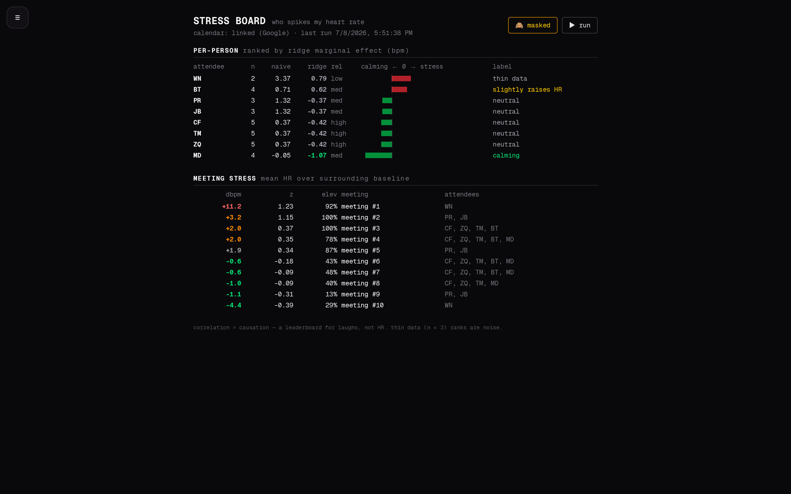

# PulseCoach Home Assistant Addon

## Overview

PulseCoach is an AI-powered sport scientist that analyzes your Garmin health
and fitness data to provide evidence-based coaching, training load management,
and recovery optimization — all running locally on your Home Assistant
instance.

It connects to Garmin Connect, syncs your metrics (heart rate, HRV, sleep,
activities, VO2max, stress, body battery), and presents everything through a
rich dashboard with optional AI coaching powered by local or cloud LLMs.

## Architecture

```text
Home Assistant OS
├── PulseCoach Addon (s6-overlay services)
│   ├── PostgreSQL 16           (/data/postgresql, longrun)
│   ├── garmin-auth             (Flask :8099, login/MFA/tokens)
│   ├── pulsecoach orchestrator
│   │   ├── garmin-sync.py      (Garmin Connect → PostgreSQL, every N min)
│   │   ├── metrics-compute.py  (CTL/ATL/TSB/ACWR/CP → PostgreSQL, every 60 min)
│   │   ├── ha-notify.py        (PostgreSQL → HA sensors, every 30 min)
│   │   ├── Next.js standalone  (:3001, tRPC + Drizzle ORM)
│   │   ├── ingress-proxy       (:3000 → :3001, HA path rewriting)
│   │   └── process monitor     (restarts dead services every 60s)
│   └── AI backend              (ha_conversation | ollama | none)
├── Ollama Addon (optional — local LLM inference)
└── Home Assistant Core
    └── Conversation Agent (optional — used by ha_conversation backend)
```

## Setup Guide

### 1. Install the Addon

Install **PulseCoach** from the Home Assistant add-on store (see the
[README](https://github.com/askb/ha-garmin-fitness-coach-addon#installation)
for repository setup).

### 2. Connect Your Garmin Account

1. **Start** the addon and open the **Web UI** (sidebar → PulseCoach).
2. Navigate to **Settings → Connect Garmin**.
3. Enter your Garmin Connect **email** and **password**.
4. If your account has **MFA** (multi-factor authentication) enabled, you will
   be prompted for the one-time code during the same flow.
5. On success the addon stores an OAuth session token locally — no credentials
   leave your network.

### 3. Configure the AI Backend

In the addon **Configuration** tab, set `ai_backend` to one of:

| Backend | Description |
|---|---|
| `ha_conversation` | Uses your existing HA Conversation agent (OpenAI, Claude, local LLM, etc.). Requires a conversation agent to be configured in HA under Settings → Voice Assistants. |
| `ollama` | Direct connection to a local [Ollama](https://ollama.com/) instance. Set `ollama_url` to the server address (e.g., `http://homeassistant.local:11434`). Fully private. |
| `none` **(default)** | Rules-based coaching only. No LLM required — still provides all data-driven insights. |

### 4. Data Sync

Once authenticated, data syncs automatically on the configured interval
(default: every 60 minutes). The first sync may take several minutes as it
fetches up to 6 years of historical data.

## Configuration Options

| Option | Type | Default | Required | Description |
|---|---|---|---|---|
| `garmin_email` | email | — | **Yes** | Garmin Connect login email |
| `garmin_password` | password | — | **Yes** | Garmin Connect password |
| `ai_backend` | list | `none` | No | AI coaching backend: `ha_conversation`, `ollama`, or `none` |
| `ollama_url` | url | — | No | Ollama server URL. Required for the `ollama` chat backend, **and** for coach memory/RAG embeddings even when `ai_backend` is `ha_conversation` or `none` (the nightly memory rebuild only runs when this is set) |
| `ollama_embed_model` | string | `nomic-embed-text` | No | Embedding model for coach memory/RAG over multi-year history. Pull it on your Ollama host; falls back to the chat model if unavailable |
| `sync_interval_minutes` | integer | `60` | No | Garmin data sync frequency in minutes (5 – 1440) |

## Garmin Authentication Troubleshooting

| Problem | Solution |
|---|---|
| **MFA code not requested** | Ensure you complete the full Settings → Connect Garmin flow in one session. If the MFA step is missed, disconnect and reconnect. |
| **403 Forbidden errors** | Garmin may rate-limit or block requests. Wait 15-30 minutes and try again. Avoid setting `sync_interval_minutes` below 30. |
| **Token expired** | Session tokens last approximately **one year**. When the addon shows an authentication alert, go to **Settings → Connect Garmin** and re-authenticate. |
| **"Invalid credentials"** | Double-check email/password. If you recently changed your Garmin password, update the addon configuration and reconnect. |
| **Sync stuck or no data** | Check the addon **Log** tab for errors. If a **manual sync** silently does nothing, the underlying error is now captured in `/data/garmin-sync.log` (rotated to `.log.1` on each run). Tail it with `cat /data/garmin-sync.log` from the addon's `Web terminal`/SSH, or call `GET /auth/sync-log` via the ingress endpoint. Restart the addon if the sync daemon is unresponsive. |

## Pages

| Page | Description |
|---|---|
| **Today** | Daily readiness score (0-100), body battery, recent activities, quick insights |
| **Training** | CTL / ATL / TSB fitness-fatigue chart, ACWR injury-risk gauge, load focus, recovery time |
| **Fitness** | VO2max trends, VDOT score, race predictions (5K / 10K / half / marathon) with confidence intervals |
| **Activities** | Activity detail — laps, efficiency factor, GAP, RPE, zone distribution, running dynamics (ground-contact time/balance, vertical oscillation/ratio, stride length) |
| **Insights** | Proactive AI insight cards — 6-rule engine (ACWR, TSB, HRV, sleep debt, ramp rate, interventions) |
| **Journal** | Whoop-style daily check-in (body feel, inputs, cycle tracking) |
| **Interventions** | Recovery intervention log with effectiveness ratings |
| **Sleep** | Sleep stages breakdown, quality trends, debt tracker, bedtime recommendations |
| **Trends** | 6+ year multi-metric overlay charts with rolling averages |
| **Coach** | AI specialist agents (sport scientist, psychologist, nutritionist, recovery coach) |
| **Power** | Critical power curve, power-duration chart, W′ |
| **Zones** | HR zone distribution, Seiler polarization index, calendar heatmap |
| **Stress Board** | Meeting stress leaderboard — per-person ridge marginal effects (calming ↔ stress) and per-meeting dbpm / z / elevation vs a ±90-min local HR baseline |
| **Settings** | Garmin account connection, AI backend configuration, sync controls |

A visual walkthrough of the main pages — Home, Fitness, Training,
Zones, Trends, and the AI Coach — is in the
[repository README](https://github.com/askb/ha-garmin-fitness-coach-addon#screenshots).

## Stress Board (Meeting Stress Leaderboard)

Ranks the people you meet by their marginal effect on your heart rate.
Inspired by the viral "I hooked my Whoop to my work calendar" experiment —
but using Garmin's all-day HR (~2-min samples), no reverse engineering.

**Method:** each meeting is scored against a ±90-min local HR baseline
(excluding other meetings): `dbpm` (mean elevation), `z` (significance),
`elev` (% of samples above baseline). A ridge regression over the
meetings × attendees matrix then estimates each person's marginal bpm
effect, de-confounding people who co-attend (your manager isn't blamed
just for being in every meeting). People with n < 3 meetings are marked
*thin data*; meetings with more than 8 attendees are skipped as noise.

The **🙈 mask toggle** (top-right of the board) aliases every attendee to
initials and rewrites meeting titles to `meeting #N`, so you can share a
screenshot without leaking who's who — this is the masked view (demo
data, all fictional):



### Calendar sources (any combination)

1. **Linked Google Calendar (recommended)** — one-time setup:
   1. Create an OAuth client (Desktop type) in Google Cloud Console and
      enable the Calendar API.
   2. On your computer run
      `python3 scripts/generate-gcal-token.py <client_secret.json>`
      (from this repo) — browser consent, read-only calendar scope.
   3. Copy the resulting `gcal-token.json` to `/share/pulsecoach/`.
      The next **Stress Board run** (not an addon restart) adopts it
      into `/data` with 0600 permissions.
2. **Events file** — export an `.ics`, convert with
   `python3 scripts/ics_to_events.py export.ics --self you@example.org`,
   and drop `calendar_events.json` in `/share/pulsecoach/`.
3. **HA-logged interactions** — log out-of-calendar contacts (coffee
   chats, family visits) to `/share/pulsecoach/interactions.jsonl` via an
   HA `shell_command`; one JSON object per line:
   `{"person": "Mum", "minutes": 30, "end": "2026-07-06T18:00:00+10:00"}`.
   A ready-made dashboard + scripts (preset buttons, freeform and
   backdated logging) lives in the companion HA config.

### Running

Open **Stress Board** from the web UI menu and hit **▶ run** — or
`POST /auth/meeting-stress` on the auth server. Results:
`/share/pulsecoach/meeting_stress.json` plus `meeting_scores.csv` and
`person_scores.csv`. Heart rate is cached per-day in `/data/hr-cache/`.

**Caveats:** correlation ≠ causation — treat it as a conversation piece,
not evidence. Raw HR also rises from *talking* (1:1s where you speak a
lot score higher). Accuracy improves mainly with more weeks of data and
consistent watch wear.

## HA Sensors

The addon pushes a set of Home Assistant sensors via the Supervisor API, including:

| Entity ID | Description |
|-----------|-------------|
| `sensor.pulsecoach_ctl` | Chronic Training Load (42-day fitness) |
| `sensor.pulsecoach_atl` | Acute Training Load (7-day fatigue) |
| `sensor.pulsecoach_form` | Training Stress Balance (TSB) |
| `sensor.pulsecoach_acwr` | Acute:Chronic Workload Ratio |
| `sensor.pulsecoach_injury_risk` | Risk level: Low / Moderate / High / Very High |
| `sensor.pulsecoach_body_battery` | Current Garmin Body Battery |
| `sensor.pulsecoach_sleep_debt` | Accumulated sleep debt (hours) |
| `sensor.pulsecoach_data_quality` | Unresolved sync-gap count (state) with `missing_days_14d`, `stale_days`, `field_gaps`, `status` (`ok`/`warn`/`error`) attributes |

## Hardware Requirements & Resource Usage

**Minimum supported hardware: Raspberry Pi 4 (or any amd64/aarch64 box)
with 2–4 GiB of RAM free for add-ons.** The addon runs a full stack —
PostgreSQL 16, a Next.js server, and several Python services — so
boards below an RPi 4 (or heavily loaded 2 GiB systems) will struggle.

| Component | RAM | CPU |
|---|---|---|
| Next.js server | ~80 MB | < 1 % idle |
| PostgreSQL database | ~30 MB (grows with history) | < 1 % |
| Garmin sync / metrics (periodic) | ~30–100 MB peak | burst |
| **Steady state** | **~150–300 MB** | **< 2 % idle** |

Storage: allow **~5 GB** for the PostgreSQL data volume as multi-year
history accumulates. Running the `ollama` AI backend locally is a
separate, much larger requirement (model dependent — typically 8 GB+)
and is not recommended on an RPi 4; use `ha_conversation` or `none`
there instead.

## Privacy

All data **processing** happens locally on your Home Assistant instance.
The only external exchanges are the ones you configure: fetching your own
data from Garmin Connect (and optionally Google Calendar), and — only if
you pick a cloud Conversation agent — AI coaching prompts. Nothing else
leaves your network.

- **Garmin Connect**: The addon authenticates directly against Garmin
  Connect; data flows only between Garmin's servers and your HA instance.
- **Unofficial API disclaimer**: the Garmin sync uses the same
  credential-based method as the popular
  [cyberjunky Garmin integration](https://github.com/cyberjunky/home-assistant-garmin_connect)
  — not Garmin's partner-only developer API. Your credentials never leave
  your Home Assistant instance, but Garmin may change or restrict this
  access at any time, which can temporarily break syncing until the addon
  is updated.
- **AI Coaching** (`ha_conversation`): Prompts are sent to whatever
  Conversation agent you have configured in HA — this may be a cloud service
  (e.g., OpenAI) depending on your setup.
- **AI Coaching** (`ollama`): All inference runs locally on your hardware.
- **AI Coaching** (`none`): No external calls of any kind.
- **Stress Board / Google Calendar**: the OAuth token is read-only
  (`calendar.readonly`), stored at `/data/gcal-token.json` (0600), and
  used only to fetch your own events + attendee names. Leaderboards are
  computed locally and written to `/share/pulsecoach/` — they contain
  **other people's names**; treat the CSVs as private and think twice
  before sharing screenshots with unmasked names.

## Support

- [GitHub Issues](https://github.com/askb/ha-garmin-fitness-coach-addon/issues)
- [Home Assistant Community Forum](https://community.home-assistant.io/)
